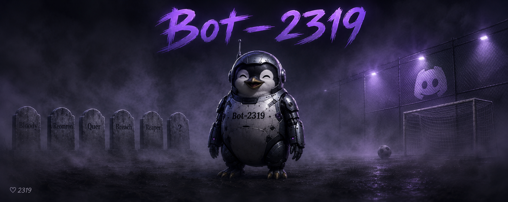

# Bot-2319

A full-stack Discord bot packed with moderation, fun, and utility tools. Built in Python with an easy setup, button-based help menu, and a fully bilingual interface. Only Paste & Run.

Bot-2319 is designed to be a single-file, zero-hassle solution for Discord server management. Whether you're running a small friend group or a larger community, it handles everything from kicking troublemakers to generating QR codes — all without any complicated configuration or database setup. Every setting is stored locally in simple JSON files, so there's nothing to install beyond the Python dependencies. The bot ships with a built-in XP and leveling system that keeps your community engaged over time, alongside a full suite of moderation tools that let staff act quickly and consistently. It also includes a variety of fun and utility commands that give members a reason to stick around and interact.

---

## Features

### 🎮 Games & Fun

| Command | Description |
|---|---|
| `!coinflip` | Flip a coin |
| `!dice` | Roll a dice (1–6) |
| `!random` | Random number between 1–100 |
| `!luckynumber` | Random lucky number + lucky color |
| `!word [letter]` | Random English word starting with that letter |
| `!guess [number]` | Guess a number between 1–100 |
| `!rps [rock/paper/scissors]` | Rock paper scissors against the bot |
| `!ship @user1 @user2` | Love compatibility rate |
| `!reverse [text]` | Reverse any text |
| `!emoji [text]` | Convert text to flag emojis |

### 🛡️ Moderation

| Command | Description |
|---|---|
| `!ban @user [reason]` | Ban a user |
| `!unban <id> [reason]` | Unban by user ID |
| `!kick @user [reason]` | Kick a user |
| `!mute @user [duration] [reason]` | Timeout a user (permanent if no duration) |
| `!unmute @user [reason]` | Remove timeout |
| `!punish @user [duration] [reason]` | Assign punished role, remove all other roles |
| `!unpunish @user` | Restore user's roles |
| `!clear [number/all]` | Delete messages or clear the entire channel |
| `!lock` | Lock the current channel |
| `!unlock` | Unlock the current channel |

Duration formats: `10s`, `10m`, `1h`, `2d` — permanent if omitted.

### 📈 XP & Rank System

Users earn 230–250 XP per message. Levels unlock rank titles automatically. *(With the in-bot credit/salary system, users who accumulate enough earnings can participate in server events, giveaways, and community activities organized by the staff — making activity actually rewarding.)*

| Rank | Level | Salary |
|---|---|---|
| 🌱 Rookie | 0 | 0 € |
| ⚽ Player | 5 | 60K € |
| 🥾 Professional | 10 | 100K € |
| ⭐ Star | 20 | 240K € |
| 🔥 Superstar | 35 | 600K € |
| 💎 Elite | 50 | 1M € |
| 👑 Captain | 65 | 1.5M € |
| 🏆 Champion | 80 | 3M € |
| 🐐 GOAT | 90 | 5M € |
| 🌍 LEGEND | 100 | 10M € |

### 🌐 Utility & Lookup

| Command | Description |
|---|---|
| `!weather [city]` | Current weather for any city |
| `!translate [text] lang:[code]` | Translate text (en, tr, de, fr, es, it, ru, ar, ja…) |
| `!lookup [domain/ip]` | Full domain or IP analysis (DNS, SSL, ports, WHOIS…) |
| `!ipinfo [ip]` | IP details via IPinfo API *(see note below)* |
| `!qr [text/link]` | Generate a QR code |
| `!ping` | Bot latency |
| `!avatar [@user]` | Show a user's avatar |
| `!server` | Server info |
| `!date` | Current date and time |

### ⏰ Other

| Command | Description |
|---|---|
| `!remind [duration] [message]` | Set a personal reminder |
| `!poll Question? \| Option1 Option2` | Create a reaction poll |
| `!pick a,b,c` | Random pick from a list |
| `!password` | Generate a secure 14-character password |
| `!level [@user]` | Show XP, level, and rank |
| `!rank` | Show all rank tiers and requirements |
| `!leaderboard` | Top 5 users by message count |

### ⚙️ Setup (Admin only)

| Command | Description |
|---|---|
| `!setup logchannel #channel` | Set the log channel |
| `!setup punishedrole @role` | Set the punished role |
| `!setup registerchannel #channel` | Set the register channel |
| `!setup unregisteredrole @role` | Set the unregistered role |
| `!setup staffrole @role` | Set the register staff role |
| `!setup remove <setting>` | Remove a setting |
| `!setup show` | View all current settings |

---

## Setup

### Install (Recommend)

Install Releases or "Bot-2319 Files Full" folder,

### Or

### 1. Clone the repository

```bash
git clone https://github.com/tc4dy/Bot2319-DiscordBot.git
cd cd Bot2319-DiscordBot/"Bot-2319 Files Full"
```

### 2. Install dependencies

```bash
discord.py
python-dotenv
ipinfo
requests
python-whois
dnspython
aiohttp
```

### 3. Get a Discord Bot Token

1. Go to [discord.com/developers/applications](https://discord.com/developers/applications)
2. Click **New Application** → give it a name → confirm
3. Go to the **Bot** tab on the left
4. Click **Reset Token** and copy your token
5. Under **Privileged Gateway Intents**, enable:
   - Server Members Intent
   - Message Content Intent
6. Go to **OAuth2 → URL Generator**, select `bot` scope and the permissions you need, then use the generated link to invite the bot to your server

### 4. Configure environment variables

Create a `.env` file in the project root:

```env
DISCORD_TOKEN=your_discord_bot_token_here
IPINFO_TOKEN=your_ipinfo_token_here
```

> **IPinfo token:** The `!ipinfo` command uses the [IPinfo API](https://ipinfo.io). Their free plan gives 50,000 requests/month — sign up at ipinfo.io to get your free token. If you don't want to use this feature, remove the `!ipinfo` command from line **1361** of `bot.py` and its entry from the help menu.

### 5. Run the bot

```bash
python bot.py
```

---

## File Structure

```
Bot2319-DiscordBot/
├── bot.py
├── .env
├── .gitignore
├── config.json
├── punished.json
├── xp_data.json
└── requirements.txt
```

---

*respect 2319 <3*
